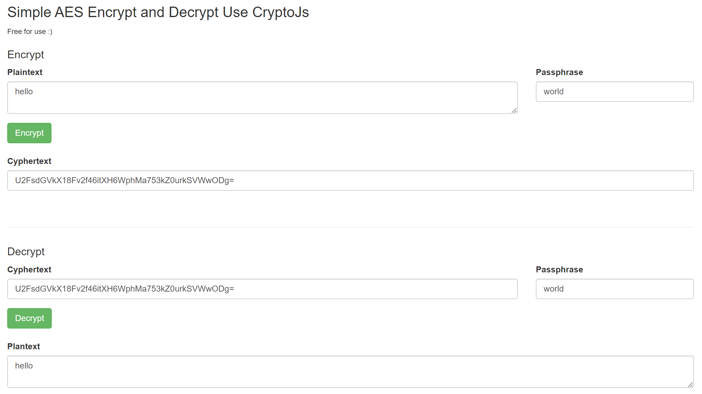

# Simple AES Encrypt and Decrypt Use CryptoJs

JavaScript implementations of standard and secure cryptographic algorithms

CryptoJS is a growing collection of standard and secure cryptographic algorithms implemented in JavaScript using best practices and patterns. They are fast, and they have a consistent and simple interface.

Original documentation: https://code.google.com/archive/p/crypto-js/

or https://cryptojs.gitbook.io/docs/